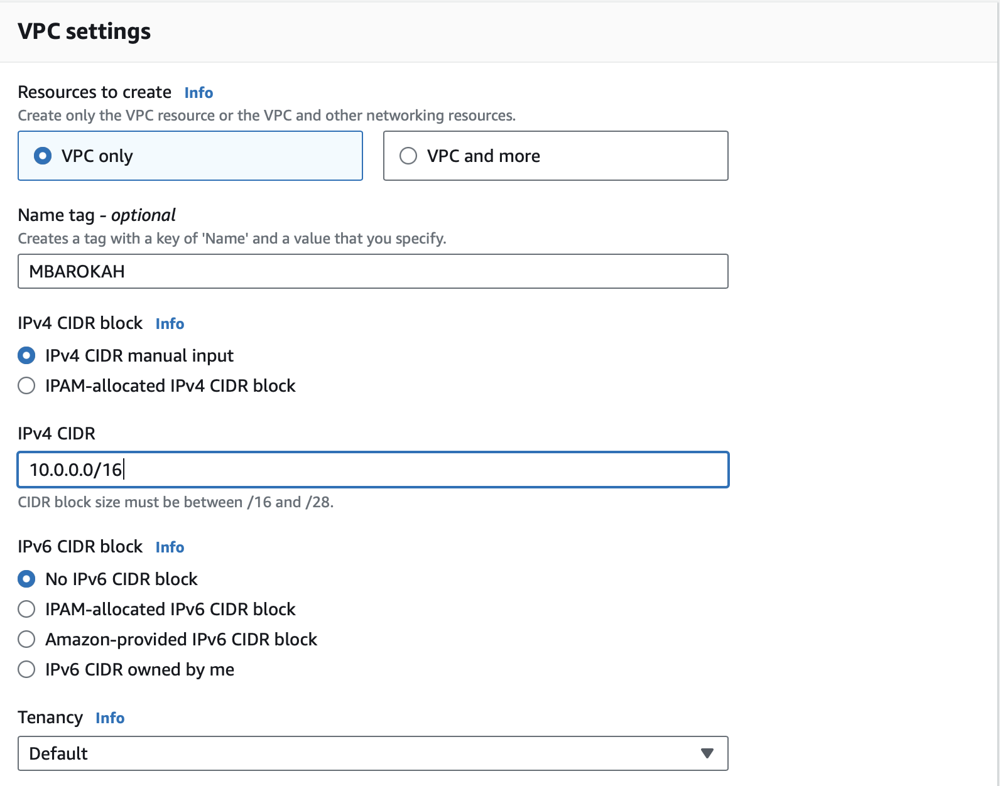
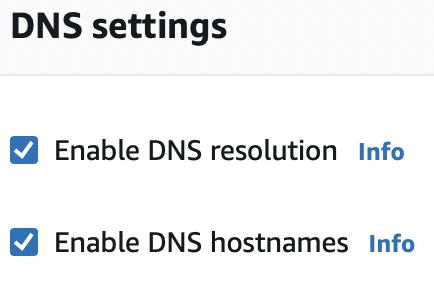
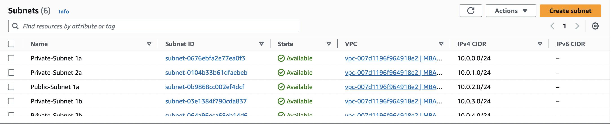
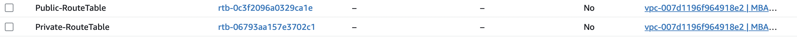
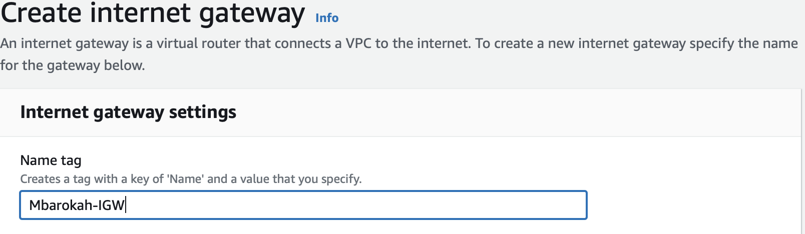
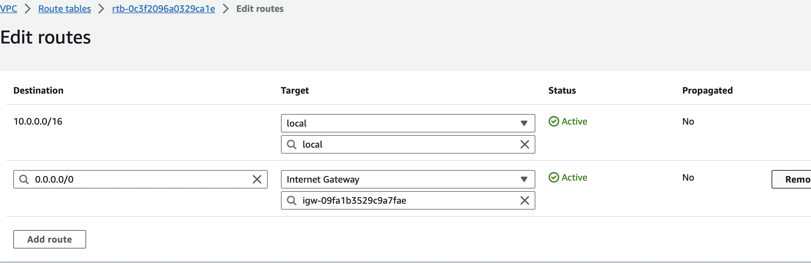

# SET UP VPC

* I created a VPC named "mbarokah" as an isolated network environment 
## Note
* By default,the DNS hostname is disabled. 
* I enabled the DNS hostname.
 
 

 # CREATE SUBNETS
 * subnets were added to the vpc to enable range of AWS resources to be deployed in the VPC
 * For context, 6 subnets were added [2 Public Subnets] [4 Private Subnets]
 * These subnets will exist within 2 avaialbiltiy zones [A and B]. That is, 3 subnets in each availabilty zone.
 * 10.0.0.0/16 CIDR consists of 65,536 IP V4 addresses [2^(32-x)]. Where x=cidr notation.
 * I randomly picked 6 IPV4 addresses within the 10.0.0.0/16 CIDR block.
  

  ## CREATE ROUTE TABLES FOR THE SUBNETS
  * 2 Route Tables were created. 1 for each group of subnets [Private and Public]
  
    

   ## CREATE INTERNET GATEWAY

   * I created internet gateway and it was enabled and attached to the VPC

     

     ## CONFIGURE A PUBLIC ROUTE TABLE

     * I edited the public route table created from ealier.
     * I associated the Internet Gateway to this route table.
     * The purpose of this is to be able to route the subnets in these group on the internet.
     * These action is not done for the Private RT.

      

  

  

  

  

  

  

  

  

  

