  ## SECTION 1- CONFIGURATION OF THE NETWORK SERVICES 

 ## SET UP VPC

* I created a VPC named "mbarokah" as an isolated network environment 
## Note
* By default,the DNS hostname is disabled. 
* I enabled the DNS hostname.
 
 


 # CREATE SUBNETS
 * subnets were added to the vpc to enable range of AWS resources to be deployed in the VPC
 * For context, 6 subnets were added [2 Public Subnets] [4 Private Subnets]
 * These subnets will exist within 2 avaialbiltiy zones [A and B]. That is, 3 subnets in each availabilty zone.
 * 10.0.0.0/16 CIDR consists of 65,536 IP V4 addresses [2^(32-x)]. Where x=cidr notation.
 * I randomly picked 6 IPV4 addresses within the 10.0.0.0/16 CIDR block.
 * 
  

  ## CREATE ROUTE TABLES FOR THE SUBNETS
  * 2 Route Tables were created. 1 for each group of subnets [Private and Public]
  
    

   ## CREATE INTERNET GATEWAY

   * I created internet gateway and it was enabled and attached to the VPC

     

     ## CONFIGURE A PUBLIC ROUTE TABLE

     * I edited the public route table created from ealier.
     * I associated the Internet Gateway to this route table.
     * The purpose of this is to be able to route the subnets in these group to the internet.
     * These action is not done for the Private RT.

  

   ## CREATE ELASTIC IP ADDRESSES

  * I created 3 Elastic IPS .
      
   
      
  ## CREATE NAT GATEWAY

 * I configured a NAT Gateway for connectivity to the internet
 * An elastic IP address was attached to this NAT Gateway at creation.
 * One of the public Subnets created earlier was also attached.

    

  ## SECTION 2 - SET UP OF THE SECURITY 

  ## CREATE SECURITY GROUP
  ## 1. Nginx Server
   * Traffic will only be allowed from external load balancer from port 80 and 443 
  * It will allow SSH access from our Bastion

       
  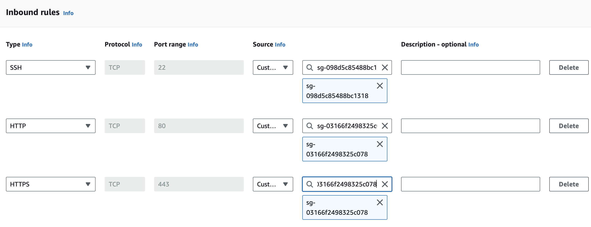

 ## 2. External Application Load Balancer
    * ALB will be available from the internet
    * This will allow traffic from any IP addreas
    * Open port 80 and 443 from 0.0.0.0/0


   


 
   

   ## 3. Bastion Server

     * I onfigured the security group to allow SSH (Port 22) from my IP address only.         
    
   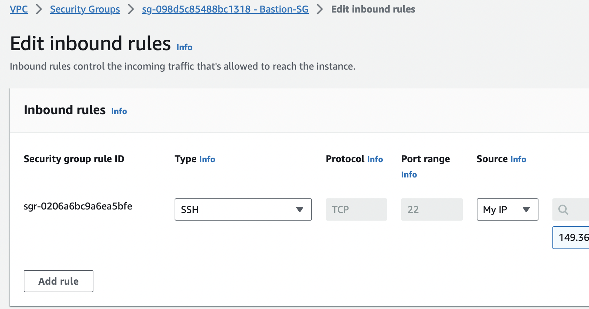
  
     ## 4. Internal Load Balancer

   * I configures this security gruop to only allow traffic from the nginx server.
   * Allowing Port 80/443 access from Nginx sg

   

   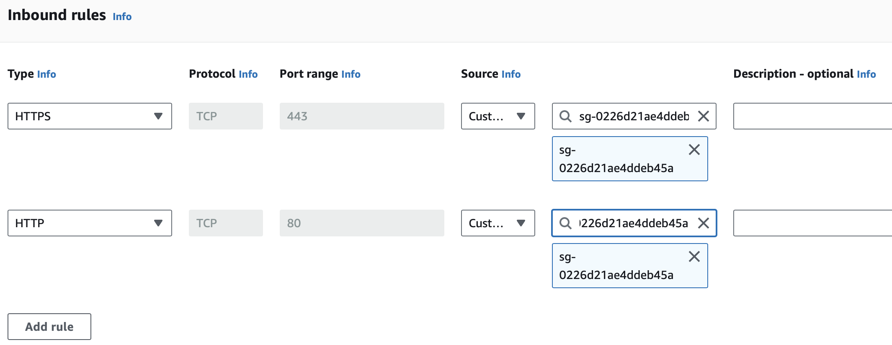

  ## 5. Data-Layer Security Groups
                 
   This layer comprises of two segments and was configured accordingly.

  ## a. Relational Database Server

   * Only traffic from webservers and bastion servers were alllowed in this layer.
        
## b. Elastic File System (EFS)

     * Nginx and Webservers will have access to EFS Mountpoint

   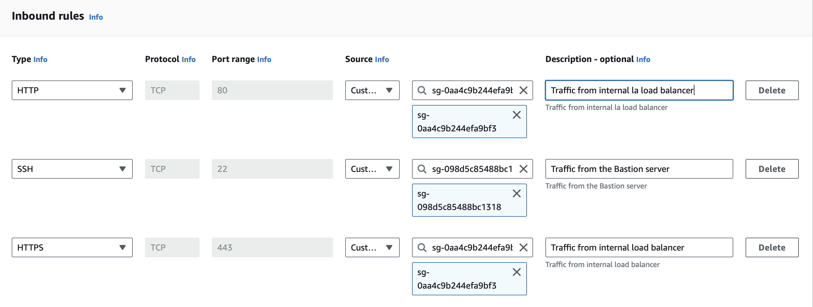
   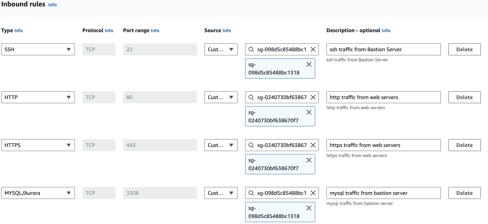

 ## Section 3 - TLS Certificates From Amazon Certificate Manager (ACM)
    * The TLS certificate is needed to handle secured connectivity to the application laodbalancer
    * I navigated to Amazon certificate manager 
    * I requested a public certificate 'mbarokah.website' 
    * Validate the certificate

   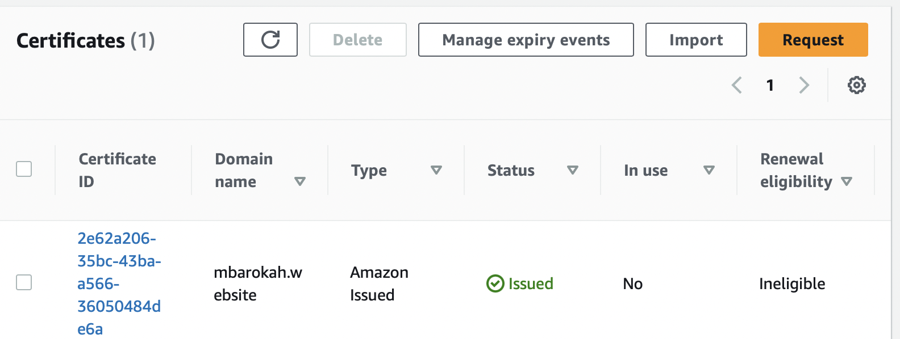

   ## Section 4 - Configuring Elastic File System

   * I created a file system within the vpc

   [Network Access]
   * For network access ,I customized mount targets which are  webservers in private subnet 1 and private subnet 2 in 2 availability zones.The mount target needs to be in the same subnet as the resource that needs to access it
   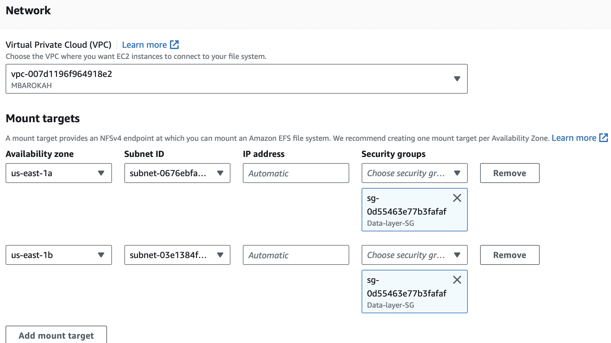

    [Access point]
      * On the EFS setup, created two access points for both tooling and wordpress applications

   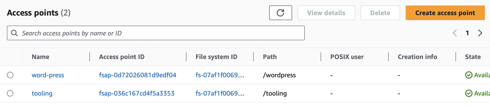

  ## RDS SET-UP

    [CREATE KMS KEY]

  * I created a Key Management System key that will be used to encrypt the database

    [CREATE SUBNET GROUP]

  * Created a subnet group and added 2 private subnets (data Layer)
   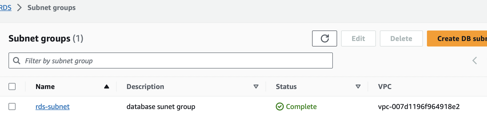 

    [CREATE DATABSAE]
   * creation method: Standard create

   * Engine options: MySQL

   * Edition: MySQL Community

   * Version: 8.0.28

   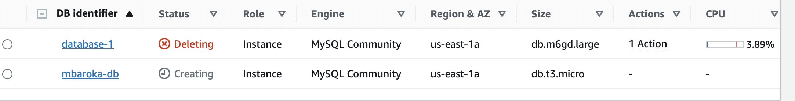

 ## Section 5 - Configuring Compute Resources
  
  [CREATE AMI]
  I spinned up 3 Red-hat based instances.[Nginx] [Bastion] [Webservers]

   [NGINX AMI INSTALL]

   
```
   yum install -y https://dl.fedoraproject.org/pub/epel/epel-release-latest-8.noarch.rpm

   yum install -y dnf-utils http://rpms.remirepo.net/enterprise/remi-release-8.rpm

   yum install wget vim python3 telnet htop git mysql net-tools chrony -y

   systemctl start chronyd

   systemctl enable chronyd

```

   * Configure selinux policies for the nginx server
   
 ```
    setsebool -P httpd_can_network_connect=1
    setsebool -P httpd_can_network_connect_db=1
    setsebool -P httpd_execmem=1
    setsebool -P httpd_use_nfs 1
```

   * Install  amazon efs utils for mounting the target on the Elastic file system

   ```
     git clone https://github.com/aws/efs-utils

     cd efs-utils

     yum install -y make
 
     yum install -y rpm-build

     make rpm
  
     yum install -y ./build/amazon-efs-utils*rpm

  ```

     [Certificate for nginx]
     
   ```
      sudo mkdir /etc/ssl/private

      sudo chmod 700 /etc/ssl/private

      openssl req -x509 -nodes -days 365 -newkey rsa:2048 -keyout /etc/ssl/private/ACS.key -out /etc/ssl/certs/ACS.crt

      sudo openssl dhparam -out /etc/ssl/certs/dhparam.pem 2048
    ```

      [BASTION]

    ```
      yum install -y https://dl.fedoraproject.org/pub/epel/epel-release-latest-8.noarch.rpm

      yum install -y dnf-utils http://rpms.remirepo.net/enterprise/remi-release-8.rpm

      yum install wget vim python3 telnet htop git mysql net-tools chrony -y

      systemctl start chronyd

      systemctl enable chronyd

   ```

      [WEBSERVER INSTALL]

     ```
      yum install -y https://dl.fedoraproject.org/pub/epel/epel-release-latest-8.noarch.rpm

      yum install -y dnf-utils http://rpms.remirepo.net/enterprise/remi-release-8.rpm

      yum install wget vim python3 telnet htop git mysql net-tools chrony -y

      systemctl start chronyd

      systemctl enable chronyd
      
     ```
         * Install  amazon efs utils for mounting the target on the Elastic file system

      ```
      git clone https://github.com/aws/efs-utils

       cd efs-utils

      yum install -y make
 
      yum install -y rpm-build
  
      make rpm

      yum install -y ./build/amazon-efs-utils*rpm
      
      ```

         * Self Assigned Certificate for Webserver

       ```
         yum install -y mod_ssl

        openssl req -newkey rsa:2048 -nodes -keyout /etc/pki/tls/private/ACS.key -x509 -days 365 -out /etc/pki/tls/certs/ACS.crt

        ```

         `vi /etc/httpd/conf.d/ssl.conf`

         * In the sssl.conf, i edited the localhost.crt and localhost.key to ACS.crt and ACS.key respectively
 

   [BASTION CONFIGURATION]

   
  ```
   yum install -y https://dl.fedoraproject.org/pub/epel/epel-release-latest-8.noarch.rpm

   yum install -y dnf-utils http://rpms.remirepo.net/enterprise/remi-release-8.rpm

   yum install wget vim python3 telnet htop git mysql net-tools chrony -y

   systemctl start chronyd

   systemctl enable chronyd
```

  ## SECTION 6 - Create AMI's from the instances

      * I created AMI for each of thr instances
   
 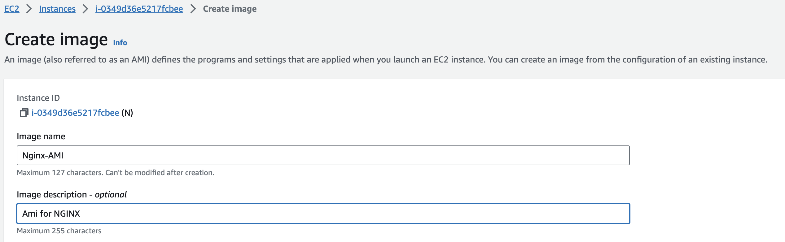

  ## SECTION 7 - Create Target Group

     Created traget groups Nginx and the servers behind the loadbalance [Tooling and Wordpress]
     * Below is the configuration.
      -- Target Type: Instance   

     -- Port https 443

     -- Protocol version http1

     -- Healthcheck path: /healthstatus

     -- Tag: acme-tooling-target -- Next

  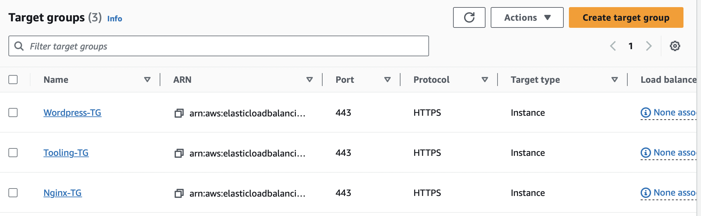

   ## SECTION 7 - CONFIGURE APPLICATION LOAD BALANCER (ALB)

   Nginx EC2 Instances will have configurations that accepts incoming traffic only from Load Balancers. No request should go directly to Nginx servers. With this kind of setup, we will benefit from intelligent routing of requests from the ALB to Nginx servers across the 2 Availability Zones. We will also be able to offload SSL/TLS certificates on the ALB instead of Nginx. Therefore, Nginx will be able to perform faster since it will not require extra compute resources to valifate certificates for every request.

   * Created Internal Application Loadbalancer

     - listens on HTTPS protocol (TCP port 443)
     - created within the appropriate VPC | AZ | Subnets
     - Choosing the Certificate already created from ACM
     - Selected Security Group for the internal load balancer
     - Selected wordpress Instance as the target group


   
   * Created External[Internet-Facing] Application Loadbalancer

     - listens on HTTPS protocol (TCP port 443)
     - created within the appropriate VPC | AZ | Subnets
     - Choosing the Certificate already created from ACM
     - Selected Security Group for the external load balancer
     - Selected Nginx Instances as the target group

     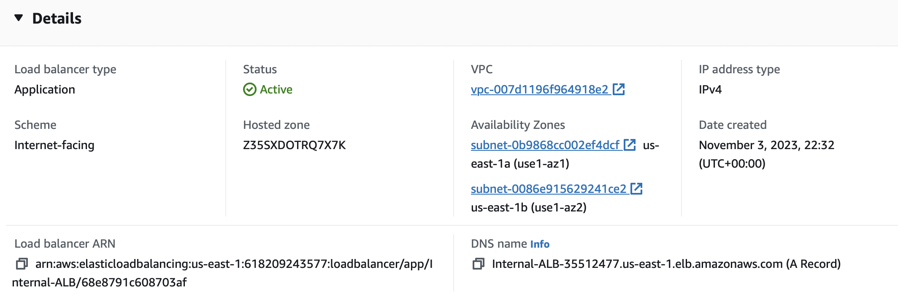

     * Route traffic coming from the nginx server into the internal loadbalancer by sending traffic to the respective target group based on the url being requested by the user.This should be done for both tooling and wordpress servers.

         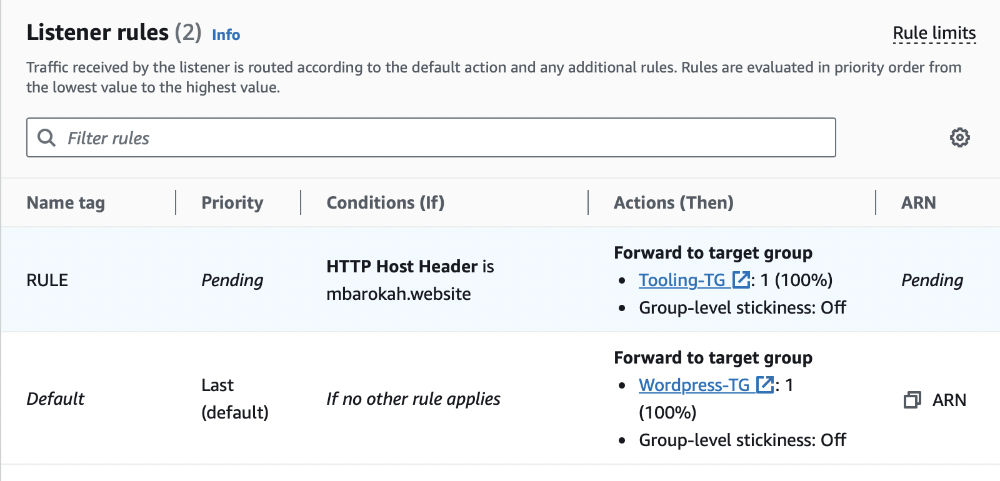

         ## SECTION 7 - LAUNCH TEMPLATE

         ## Bastion Launch Template

         * Name: Bastion Template

         * Description: Template for bastion

         * Application and OS Images: Bastion AMI

         * Instance type: t2.micro

         * Key-Pair: My Keypair

         * ADD NETWORK INTERFACE

           - Subnet:acme-public-subnet-1

           - security group: bastion-sg

           - Auto-assign public IP: enable
 
           - userdata:

        ```
           #!/bin/bash 
          yum install -y mysql 
          yum install -y git tmux 
          yum install -y ansible
        ```

      ## Nginx Launch Template

   * Name: Nginx Template

   * Description: Template for Nginx
 
   * Application and OS Images: Nginx AMI

   * Instance type: t2.micro

   * Key-Pair: My Keypair

   * ADD NETWORK INTERFACE

    - Subnet:acme-public-subnet-1

    - security group: Nginx-sg

    - Auto-assign public IP: enable
 
    - userdata:

```
   #!/bin/bash
   yum install -y nginx
   systemctl start nginx
   systemctl enable nginx
   git clone https://github.com/Mubarokahh/ACS-project-config.git
   mv/ACS-project-config/reverse.conf/etc/nginx/
   mv/etc/nginx/nginx.conf/etc/nginx/ngjnx.conf-distro
   cd /etc/nginx/
   touch nginx.conf
   sed -n 'w nginx.conf' reverse.conf
   systemctl restart nginx
   rm -rf reverse conf
   rm-rf /ACS-project-config

```

   ## Wordpress Launch Template

      * Name: Wordpress Template

      * Description: Template for Nginx

      * Application and OS Images: Webserver AMI

      * Instance type: t2.micro

      * Key-Pair: My Keypair

      * ADD NETWORK INTERFACE

           - Subnet:public-subnet-1

           - security group: Webserver-sg

           - Auto-assign public IP: disable
 
           - userdata:

   ```
          #!/bin/bash
    mkdir /var/www/
    sudo mount -t efs -o tls,accesspoint=fsap-0d72026081d9edf04 fs-07af1f006986e6206:/  /var/www/
    yum install -y httpd 
    systemctl start httpd
     systemctl enable httpd
    yum module reset php -y
     yum module enable php:remi-7.4 -y
      yum install -y php php-common php-mbstring php-opcache php-intl php-xml php-gd php-curl php-mysqlnd php-fpm php-json
    systemctl start php-fpm
    systemctl enable php-fpm
    wget http://wordpress.org/latest.tar.gz
    tar xzvf latest.tar.gz
    rm -rf latest.tar.gz
    cp wordpress/wp-config-sample.php wordpress/wp-config.php
    mkdir /var/www/html/
   cp -R /wordpress/* /var/www/html/
    cd /var/www/html/
   touch healthstatus
    sed -i "s/localhost/mbaroka-db.ctzutolm3olz.us-east-1.rds.amazonaws.com/g" wp-config.php 
   sed -i "s/username_here/admin/g" wp-config.php 
   sed -i "s/password_here/admin1234/g" wp-config.php 
   sed -i "s/database_name_here/wordpressdb/g" wp-config.php 
   chcon -t httpd_sys_rw_content_t /var/www/html/ -R
   systemctl restart httpd

``` 


  ## NOTE

   To get the accesspoint included in the meta data above, we musts go to our AWS file system > Access points > click on attach and copy the EFS mount helper code for wordpress
   
   `sudo mount -t efs -o tls,accesspoint=fsap-036c167cd4f5a3353 fs-07af1f006986e6206:/ efs`

   ## Tooling Launch Template

         

         * Application and OS Images: Webserver AMI

         * Instance type: t2.micro

         * Key-Pair: My Keypair

         * ADD NETWORK INTERFACE

           - Subnet:public-subnet-1

           - security group: Webserver-sg

           - Auto-assign public IP: enable
 
           - userdata:


```
   #!/bin/bash
mkdir /var/www/
sudo mount -t efs -o tls,accesspoint=fsap-036c167cd4f5a3353 fs-07af1f006986e6206:/  /var/www/
yum install -y httpd 
systemctl start httpd
systemctl enable httpd
yum module reset php -y
yum module enable php:remi-7.4 -y
yum install -y php php-common php-mbstring php-opcache php-intl php-xml php-gd php-curl php-mysqlnd php-fpm php-json
systemctl start php-fpm
systemctl enable php-fpm
wget http://wordpress.org/latest.tar.gz
tar xzvf latest.tar.gz
rm -rf latest.tar.gz
cp wordpress/wp-config-sample.php wordpress/wp-config.php
mkdir /var/www/html/
cp -R /wordpress/* /var/www/html/
cd /var/www/html/
touch healthstatus
sed -i "s/localhost/mbaroka-db.ctzutolm3olz.us-east-1.rds.amazonaws.com/g" wp-config.php 
sed -i "s/username_here/admin/g" wp-config.php 
sed -i "s/password_here/admin1234/g" wp-config.php 
sed -i "s/database_name_here/wordpressdb/g" wp-config.php 
chcon -t httpd_sys_rw_content_t /var/www/html/ -R
systemctl restart httpd

```
  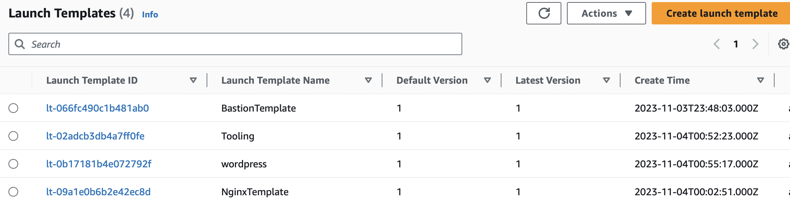

   ## SECTION 8- CONFIGURE AutoScaling Group

   [NGINX AUTO SCALING GROUP]

    Name: Nginx-ASG

    Launch template: Nginxtemplate

   adhere to launch template: selected (default)

   VPC: myvpc

     Subnet: Public subnet 1 and Public subnet 2

     Attach to an existing load balancer: Choose from your load balancer target groupsHealth checks:

    check ELB health check

    Group size: leave all at 1 for now Desired 1 Minimum 1 Maximum 1

    Scaling Policy > Target tracking scaling policy

    Metric Type: Average CPU Utilization

   Target: 90

   Add a topic: Bastion-notification


   Click create autoscaling group


   [BASTION AUTO SCALING GROUP]

   Name: Bastion-ASG

  Launch template: acme-bastion-template

  adhere to launch template: selected (default)

   VPC: myvpc

  Subnet: Public subnet 1 and Public subnet 2

  No load balancer selected(default)

  check ELB health check

  Group size: leave all at 1 for now Desired 1 Minimum 1 Maximum 1

   Scaling Policy > Target tracking scaling policy

   Metric Type: Average CPU Utilization

   Target: 90

   Add a topic: Nginx-notification

   Click create autoscaling group

  ## NOTE
  
     Before creating the wordpress ASG, I will go into the bastion to create the wordpress database and tooling dtabase with RDS endpoint

 *  TOOLING AUTO SCALING GROUP

  Name: Tooling-ASG

Launch template:Tooling-template

adhere to launch template: selected (default)

VPC: myvpc

Subnet: Public subnet 1 and Public subnet 2

No load balancer selected(default)

check ELB health check

Group size: leave all at 1 for now Desired 1 Minimum 1 Maximum 1

Scaling Policy > Target tracking scaling policy

Metric Type: Average CPU Utilization

Target: 90

Click create autoscaling group

* WORDPRESS AUTO SCALING GROUP
      
 Name: Wordpress-ASG

Launch template:Wordpress-template

adhere to launch template: selected (default)

VPC: myvpc

Subnet: Public subnet 1 and Public subnet 2

No load balancer selected(default)

check ELB health check

Group size: leave all at 1 for now Desired 1 Minimum 1 Maximum 1

Scaling Policy > Target tracking scaling policy

Metric Type: Average CPU Utilization

Target: 90

Add a topic: Wordpress-notification

Click create autoscaling group


   ## SECTION 9 - CREATE RECORDS FOR OUR LOAD BALANCERS

   * ROUTE 53 > Hosted zones>workachoo.com > create record
   * Aliases;yes

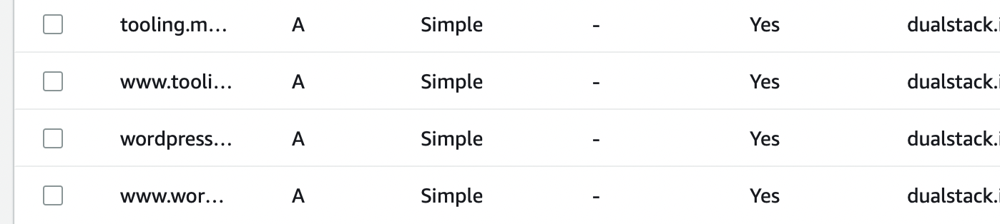


